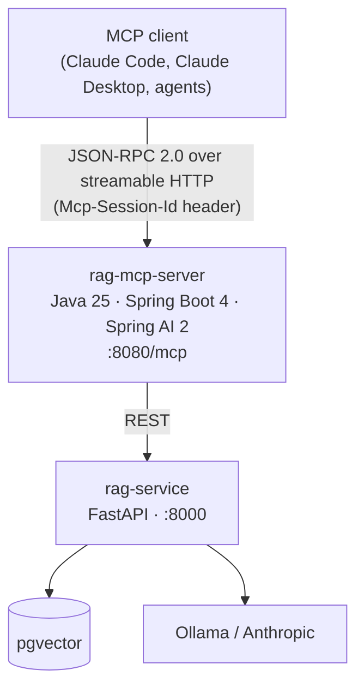
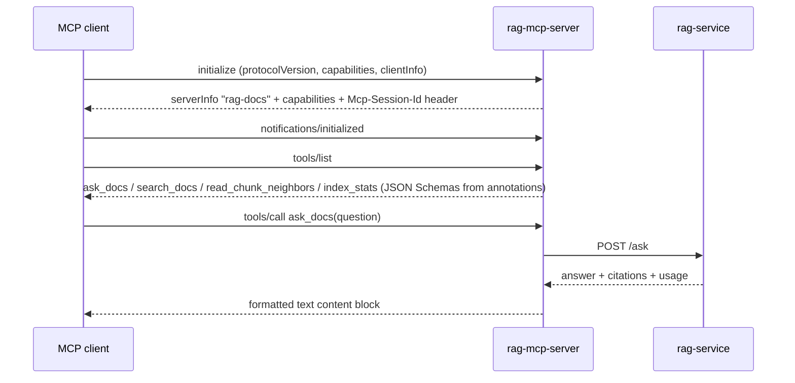

# rag-mcp-server

[](https://github.com/Adz-ai/rag-mcp-server/actions/workflows/ci.yml)

A [Model Context Protocol](https://modelcontextprotocol.io) server in Java 25 /
Spring Boot 4, exposing a RAG service ([rag-service](https://github.com/Adz-ai/rag-service)) as tools
that any MCP client — Claude Code, Claude Desktop, an agent framework — can
discover and call.



## Tools

| Tool | What it does |
|---|---|
| `ask_docs(question, topK?, source?)` | Grounded, cited answer from the indexed corpus; honestly refuses when the corpus doesn't cover the question. `source` scopes retrieval to a document/collection |
| `search_docs(query, topK?, source?)` | Raw hybrid (vector + keyword) retrieval — passages with scores, no generation |
| `read_chunk_neighbors(source, chunkIndex, before?, after?)` | The text around a search hit, in document order — widen context at read time. Served as one contiguous span of the source document when the service provides it (no repeated overlap text), falling back to per-chunk output |
| `index_stats()` | Corpus size and service health |

Design notes: tool **descriptions are prompts** (they tell the model *when* to
call, not just what the tool does); results are **formatted text**, not JSON
(the consumer is a model, not a parser); failures return as **actionable text**
rather than protocol errors, so the model can react.

## Resources and prompts (the other two MCP primitives)

| Primitive | What it exposes |
|---|---|
| Resource `rag://documents` | The indexed document list (source, title, chunk count) — application-readable context a client can attach to a conversation |
| Prompt `research_the_docs(topic, source?)` | A user-invoked template that drives the tools correctly: multi-query search, neighbor expansion around the best hits, cited synthesis |

Tools are model-invoked actions; resources are application-controlled context;
prompts are user-invoked templates. This server implements all three.

## Run it

```bash
# prerequisites: rag-service running on :8000 (see its README)
./mvnw spring-boot:run     # MCP endpoint at http://localhost:8080/mcp
./mvnw test
```

Connect from Claude Code:

```bash
claude mcp add rag-docs --transport http http://localhost:8080/mcp
# then in a session: "use ask_docs to find out what training/serving skew is"
```

## Protocol notes (learned by speaking it raw)



The MCP lifecycle over streamable HTTP, reproducible with curl:

1. `initialize` — client POSTs capabilities + protocol version; server replies
   with its identity (`rag-docs`) and capabilities, and issues an
   `Mcp-Session-Id` header that all subsequent requests must carry.
2. `notifications/initialized` — client confirms; the session is live.
3. `tools/list` — server advertises tools with JSON Schemas **generated from
   the `@McpTool`/`@McpToolParam` annotations** (Java parameter names and
   types become the schema).
4. `tools/call` — invocation; results return as content blocks.

Requests must send `Accept: application/json, text/event-stream` — responses
may arrive SSE-framed.

## Spring Boot 4 / Spring AI 2 gotchas encountered

- MCP annotations live in `org.springframework.ai.mcp.annotation` (moved into
  Spring AI core in 2.0); SSE transport is deprecated in favour of `STREAMABLE`.
- `RestClient.Builder` is no longer auto-configured by the web starter — Boot 4
  modularised HTTP clients into `spring-boot-starter-restclient`.
- Jackson 3: databind moved to the `tools.jackson` namespace.
- The JDK `HttpClient` attempts an h2c upgrade on plaintext HTTP by default,
  which uvicorn rejects — pinned to HTTP/1.1 via a `RestClientCustomizer`.
